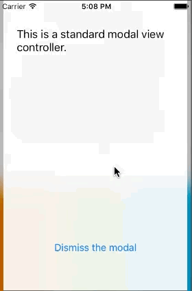

AGBlurTransition
================

Custom transition delegate for presenting modal views with a blur background in a frame usin the new iOS7 custom transitions API.


Why use AGBlurTransition?
------------------------

There are many implementations of view controllers and blur effects. However, they all require changing the code to adapt to their API for presenting/dismissing. With this library, your code will stay using regular modal view controller methods for preseting/dismissing, all you need to do is indicate the transition delegate before presenting it.




Installation
------------

Copy the files in `src` folder or install it with [CocoaPods](http://cocoapods.org/)
```
pod 'AGBlurTransition'
```

Use
---

In any view controller that wants to presents a modal with blur background, import the library:

```
#import "UIViewController+AGBlurTransition.h"
```

And set the `transitioningDelegate` and `modalPresentationStyle`. Example:

```
    AGModalViewController *vc = [[AGModalViewController alloc] init];
    self.modalPresentationStyle = UIModalPresentationCustom;
    vc.transitioningDelegate = self.AG_blurTransitionDelegate;
    [self presentViewController:vc animated:YES completion:nil];
```

You can also customize the main styling attributes using the properties declared in the `AGBlurTransitionDelegate` class. Example:

```
    self.AG_blurTransitionDelegate.tintColor = [UIColor colorWithWhite:1 alpha:0.5];
```


Caveats
-------


* **iOS7**: The component makes use of the iOS7 custom transitions API. Hence, only iOS7 and later are supported.

* **Fixed size**: The transition delegate does not observe changes on the size of the view, so rotations or other view manipulations are not supported.

* **Static background**: The glass background is composed by bluring a screenshot of the parent view in the moment of presenting the modal. Changes in the parent view will not be reflected on the blurred background.


License
-------

Made available under the MIT License.


Collaboration
-------------

Forks, patches and other feedback are always welcome.


Thanks for your pull requests to:
- [maxmamis](https://github.com/maxmamis)
- [Vladislav Jevremović](https://github.com/VladislavJevremovic)


Credits
-------


AGBlurTransition is brought to you by [Angel Garcia Olloqui](http://angelolloqui.com). You can contact me on:

Project Page: [AGBlurTransition](https://github.com/angelolloqui/AGBlurTransition)

Personal webpage: [angelolloqui.com](http://angelolloqui.com)

Twitter: [@angelolloqui](http://twitter.com/angelolloqui)

LinkedIn: [angelolloqui](http://www.linkedin.com/in/angelolloqui)


